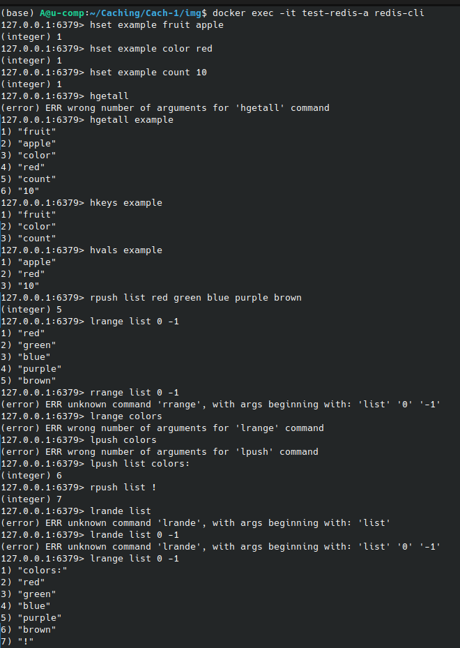

# Домашнее задание к занятию "`GitLab`" - `Болтунов Алексей`

### Инструкция по выполнению домашнего задания

   1. Сделайте `fork` данного репозитория к себе в Github и переименуйте его по названию или номеру занятия, например, https://github.com/имя-вашего-репозитория/git-hw или  https://github.com/имя-вашего-репозитория/7-1-ansible-hw).
   2. Выполните клонирование данного репозитория к себе на ПК с помощью команды `git clone`.
   3. Выполните домашнее задание и заполните у себя локально этот файл README.md:
      - впишите вверху название занятия и вашу фамилию и имя
      - в каждом задании добавьте решение в требуемом виде (текст/код/скриншоты/ссылка)
      - для корректного добавления скриншотов воспользуйтесь [инструкцией "Как вставить скриншот в шаблон с решением](https://github.com/netology-code/sys-pattern-homework/blob/main/screen-instruction.md)
      - при оформлении используйте возможности языка разметки md (коротко об этом можно посмотреть в [инструкции  по MarkDown](https://github.com/netology-code/sys-pattern-homework/blob/main/md-instruction.md))
   4. После завершения работы над домашним заданием сделайте коммит (`git commit -m "comment"`) и отправьте его на Github (`git push origin`);
   5. Для проверки домашнего задания преподавателем в личном кабинете прикрепите и отправьте ссылку на решение в виде md-файла в вашем Github.
   6. Любые вопросы по выполнению заданий спрашивайте в чате учебной группы и/или в разделе “Вопросы по заданию” в личном кабинете.
   
Желаем успехов в выполнении домашнего задания!
   
### Дополнительные материалы, которые могут быть полезны для выполнения задания

1. [Руководство по оформлению Markdown файлов](https://gist.github.com/Jekins/2bf2d0638163f1294637#Code)

---

### Задание 1

`Приведите ответ в свободной форме........`

1. Высокая нагрузка на базу данных  

Проблема:  Приложение получает много запросов к базе данных, что приводит к перегрузке и увеличению времени отклика. 

Решение через кеширование:  

    Кешировать результаты частых SQL-запросов.
    Читать данные из кэша, а не из БД, если данные не изменились.
    Пример: кэширование списка новостей, каталога товаров, профилей пользователей.
     

 
2. Медленные ответы от внешних API  

Проблема:  Приложение делает частые запросы к медленным или ограниченному числу внешних API (например, погода, курсы валют). 

Решение через кеширование:  

    Сохранять результаты внешних запросов в кэше на определённое время.
    Пример: кэширование курсов валют на 5 минут, чтобы не вызывать API каждый раз.
     

 
3. Часто запрашиваемые, но редко изменяемые данные  

Проблема:  Приложение часто запрашивает данные, которые редко обновляются (например, справочники, настройки сайта, статические страницы). 

Решение через кеширование:  

    Хранить такие данные в кэше, чтобы не выполнять лишние вычисления или запросы.
    Пример: кэширование меню сайта, правил использования, справочных данных.
     

 
4. Сессии пользователей  

Проблема:  Необходимо хранить данные сессий пользователей в распределённом приложении (например, веб-фарме), где доступ к локальному хранилищу невозможен. 

Решение через кеширование:  

    Использовать Redis или Memcached как хранилище сессий.
    Пример: хранение информации о текущем состоянии пользователя (логин, корзина, настройки).
     

 
5. Распределённое кэширование в микросервисной архитектуре  

Проблема:  Несколько микросервисов запрашивают одни и те же данные, что приводит к дублированию запросов и нагрузке на общие ресурсы. 

Решение через кеширование:  

    Централизованное хранение часто используемых данных в кэше.
    Пример: общий кэш для всех сервисов, обращающихся к данным о пользователях.
     

 
6. Кэширование результатов вычислений  

Проблема:  Приложение часто выполняет сложные вычисления или обработку данных, которые занимают много времени. 

Решение через кеширование:  

    Сохранять результаты вычислений в кэше и использовать их повторно.
    Пример: кэширование результатов поиска, отчётов или агрегаций.
     

 
7. Защита от DDoS или резкого роста трафика  

Проблема:  Резкий всплеск трафика может привести к перегрузке серверов. 

Решение через кеширование:  

    Кэшировать статические и часто запрашиваемые данные, чтобы минимизировать нагрузку на бэкенд.
    Пример: кэширование главной страницы сайта или популярных статей при всплеске посещаемости.
     

 
8. Повышение скорости отклика приложения  

Проблема:  Приложение медленно отвечает, что ухудшает пользовательский опыт. 

Решение через кеширование:  

    Хранить "горячие" данные в памяти — доступ к ним значительно быстрее, чем к диску или удалённой БД.
    Пример: кэширование популярных изображений, часто используемых JSON-ответов.
     
---

### Задание 2

`Приведите ответ в свободной форме........`

---

### Задание 3

---

### Задание 4

---

### Задание 5

---
